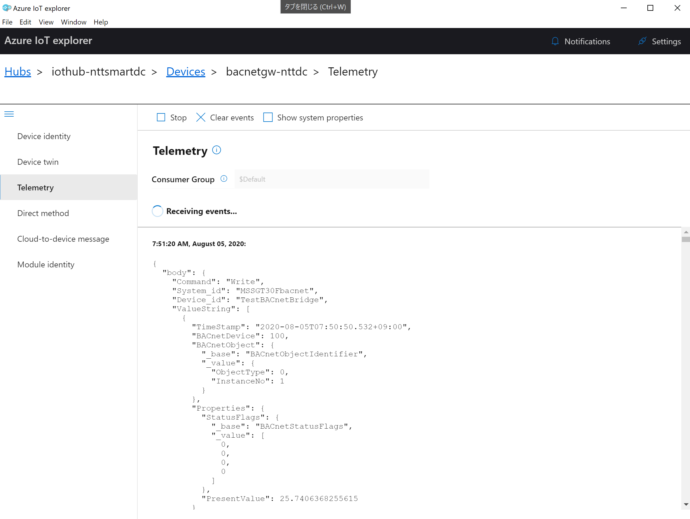
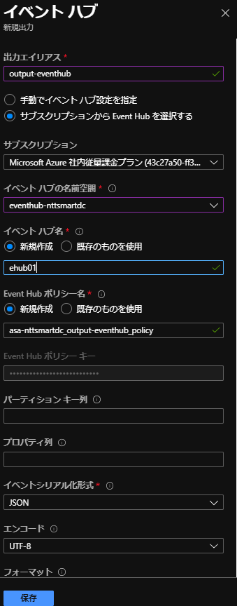
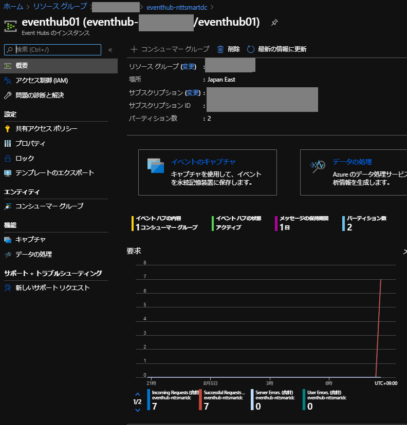
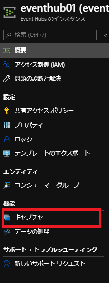

1. Create IoTHub
2. Create Device
3. Copy Device Connection String
4. Set Device Connection String to the device
5. Confirm Message from IoTHub
    - Install Azure IoT Explorer
        - https://docs.microsoft.com/ja-jp/azure/iot-pnp/howto-use-iot-explorer
        - https://github.com/Azure/azure-iot-explorer/releases
    - Copy IoTHub Service Connection String
    - Set to Azure IoT Explorer
    - Select Telemetry
    - Start Monitoring Message
      
6. Create Consumer Group
7. Create Stream Analytics Job
8. Create Blob Container
9. Create Input
10. Create Output for Blob
11. Set Query for Blob
    ```
    SELECT
    *
    INTO
        [output-blob]
    FROM
        [input-iothub]
    ```
12. Start Job
13. Confirm Output Data in Blob
    ```
    {
        "Command": "Write",
        "System_id": "MSSGT30Fbacnet",
        "Device_id": "TestBACnetBridge",
        "ValueString": [
            {
                "TimeStamp": "2020-08-05T08:08:50.535+09:00",
                "BACnetDevice": 100,
                "BACnetObject": {
                    "_base": "BACnetObjectIdentifier",
                    "_value": {
                    "ObjectType": 0,
                    "InstanceNo": 1
                    }
                },
                "Properties": {
                    "StatusFlags": {
                        "_base": "BACnetStatusFlags",
                        "_value": [
                            0,
                            0,
                            0,
                            0
                        ]
                        },
                        "PresentValue": 25.7406368255615
                }
            },
            {
            "TimeStamp": "2020-08-05T08:08:50.540+09:00",
            .....
            }
        ],
        "EventProcessedUtcTime": "2020-08-04T23:09:52.2496455Z",
        "PartitionId": 0,
        "EventEnqueuedUtcTime": "2020-08-04T23:09:52.1160000Z",
        "IoTHub": {
            "MessageId": null,
            "CorrelationId": null,
            "ConnectionDeviceId": "bacnetgw-nttdc",
            "ConnectionDeviceGenerationId": "637321770918468852",
            "EnqueuedTime": "2020-08-04T23:09:52.0000000"
        }
    }
    ```

14. Stop Job
15. Custmize Query for Blob
    ```
    WITH streamdata as(
        SELECT
            event.Command as command,
            event.system_id as system_id,
            event.device_id as device_id,
            arrayElement.ArrayIndex as arrayindex,
            TRY_CAST(arrayElement.ArrayValue.TimeStamp as datetime) as timestamp,
            arrayElement.ArrayValue.BACnetDevice as bacnetdevicenumber,
            arrayElement.ArrayValue.BACnetObject._base as bo_base,
            arrayElement.ArrayValue.BACnetObject._value.objecttype,
            arrayElement.ArrayValue.BACnetObject._value.instanceno,
            arrayElement.ArrayValue.Properties.StatusFlags._base as sf_base,
            arrayElement.ArrayValue.Properties.StatusFlags._value as sf_value,
            arrayElement.ArrayValue.Properties.presentvalue as value,
            event.EventProcessedUtcTime,
            event.PartitionId,
            event.EventEnqueuedUtcTime,
            event.IoTHub as IoTHub
        FROM [input-iothub] as event
        CROSS APPLY GetArrayElements(event.ValueString) AS arrayElement
    )

    SELECT 
        * 
    INTO 
        [output-blob] 
    FROM 
        streamdata
    ```

16. Start Job/Confirm OutPut in Blob/Stop Job
    ```
    {"command":"Write","system_id":"MSSGT30Fbacnet","device_id":"TestBACnetBridge","arrayindex":0,"timestamp":"2020-08-04T23:26:50.4820000Z","bacnetdevicenumber":100,"bo_base":"BACnetObjectIdentifier","objecttype":0,"instanceno":1,"sf_base":"BACnetStatusFlags","sf_value":[0,0,0,0],"value":25.7406368255615,"EventProcessedUtcTime":"2020-08-04T23:28:37.9514018Z","PartitionId":0,"EventEnqueuedUtcTime":"2020-08-04T23:27:20.6200000Z","IoTHub":{"MessageId":null,"CorrelationId":null,"ConnectionDeviceId":"bacnetgw-nttdc","ConnectionDeviceGenerationId":"637321770918468852","EnqueuedTime":"2020-08-04T23:27:20.0000000"}}
    {"command":"Write","system_id":"MSSGT30Fbacnet","device_id":"TestBACnetBridge","arrayindex":1,"timestamp":"2020-08-04T23:26:50.4980000Z","bacnetdevicenumber":100,"bo_base":"BACnetObjectIdentifier","objecttype":0,"instanceno":2,"sf_base":"BACnetStatusFlags","sf_value":[0,0,0,0],"value":19.261812210083,"EventProcessedUtcTime":"2020-08-04T23:28:37.9514018Z","PartitionId":0,"EventEnqueuedUtcTime":"2020-08-04T23:27:20.6200000Z","IoTHub":{"MessageId":null,"CorrelationId":null,"ConnectionDeviceId":"bacnetgw-nttdc","ConnectionDeviceGenerationId":"637321770918468852","EnqueuedTime":"2020-08-04T23:27:20.0000000"}}
    {"command":"Write","system_id":"MSSGT30Fbacnet","device_id":"TestBACnetBridge","arrayindex":2,"timestamp":"2020-08-04T23:26:50.5030000Z","bacnetdevicenumber":100,"bo_base":"BACnetObjectIdentifier","objecttype":0,"instanceno":3,"sf_base":"BACnetStatusFlags","sf_value":[0,0,0,0],"value":16.0978870391846,"EventProcessedUtcTime":"2020-08-04T23:28:37.9514018Z","PartitionId":0,"EventEnqueuedUtcTime":"2020-08-04T23:27:20.6200000Z","IoTHub":{"MessageId":null,"CorrelationId":null,"ConnectionDeviceId":"bacnetgw-nttdc","ConnectionDeviceGenerationId":"637321770918468852","EnqueuedTime":"2020-08-04T23:27:20.0000000"}}
    .....
    ```
17. Create EventHub
18. Create Output for EventHub

    

19. Set Query for EventHub
    ```
    SELECT 
        * 
    INTO 
        [output-eventhub] 
    FROM 
        streamdata
    ```

20. Start Job
21. Confirm Ingress in EventHub
    
22. Create Blob Container(for EventHub Caputure) 
23. Set EventHub Capture

    


