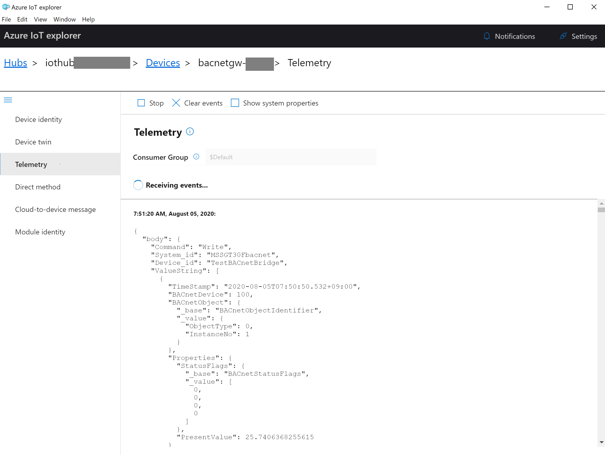
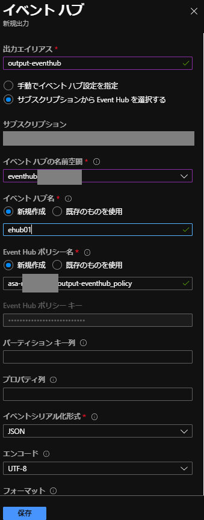
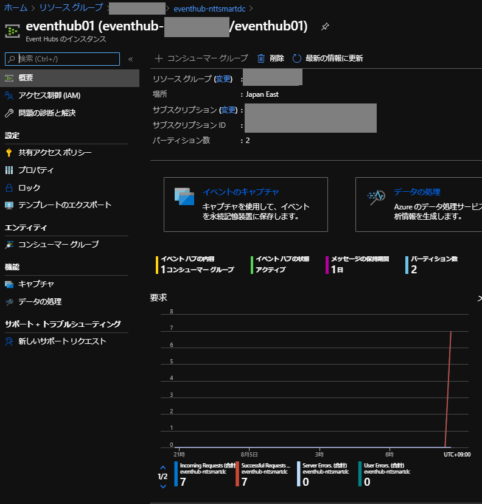
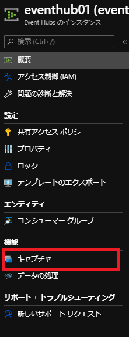
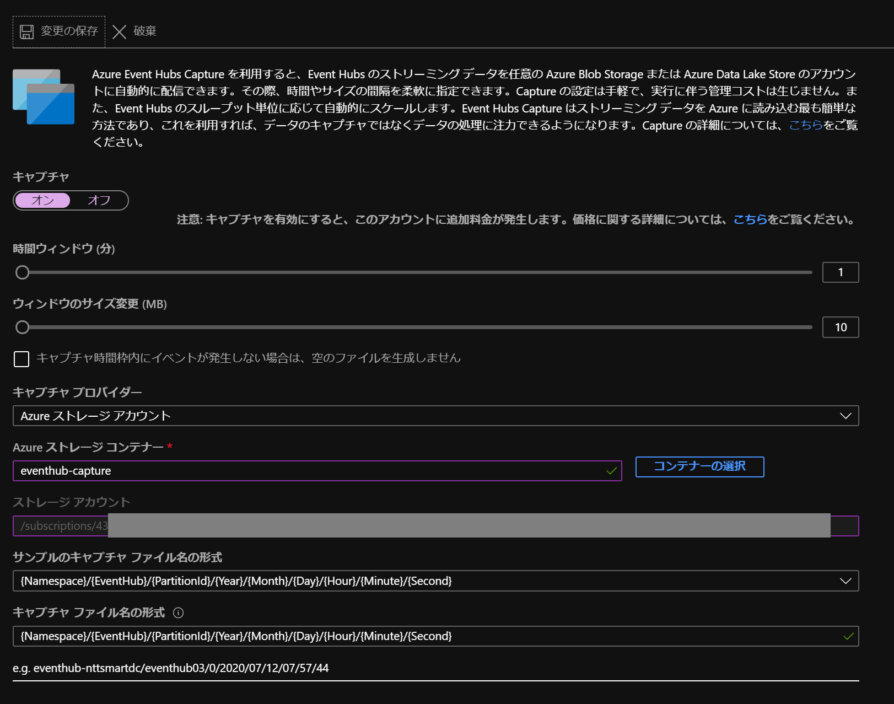
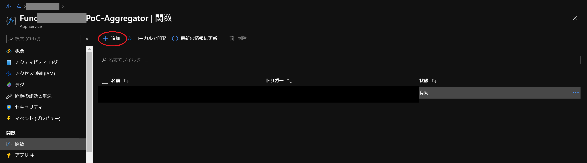
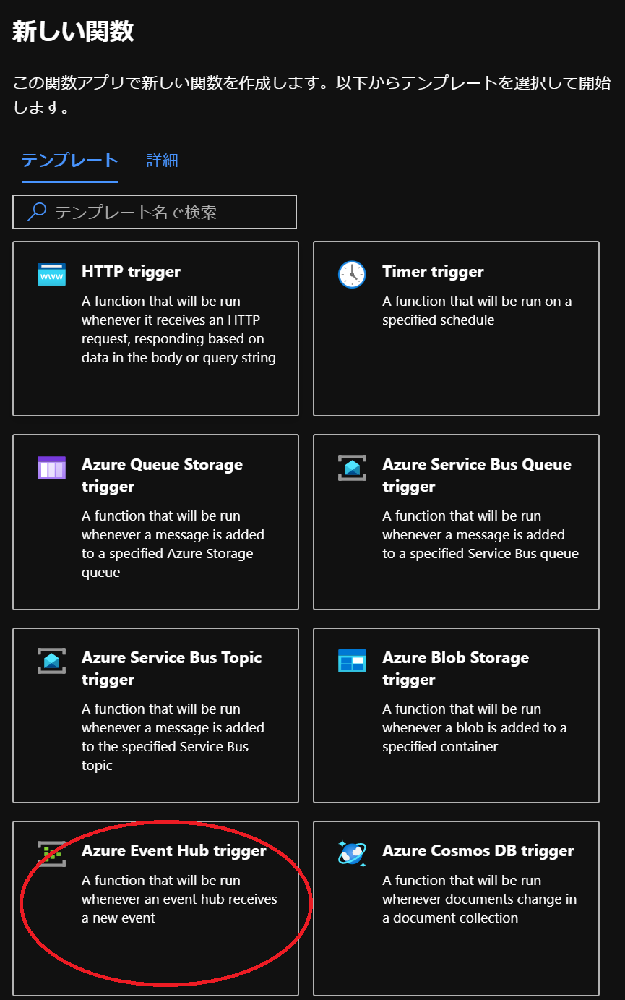
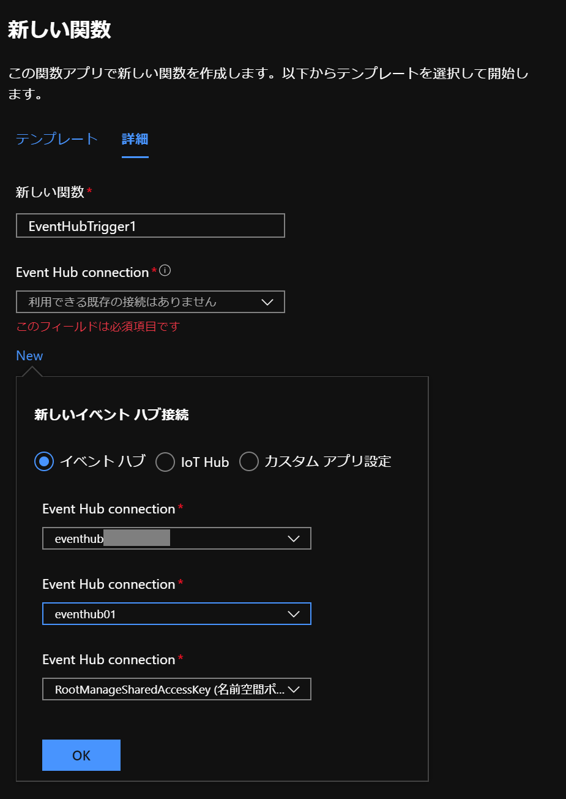
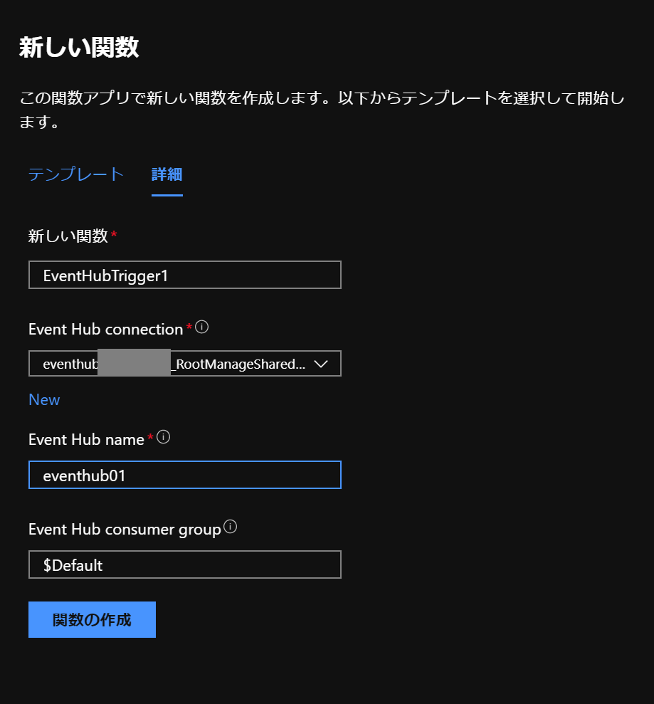

## Create IoTHub and Start to send data
1. Create IoTHub
2. Create Device
3. Copy Device Connection String
4. Set Device Connection String to the device
5. Confirm Message from IoTHub
    - Install Azure IoT Explorer
        - https://docs.microsoft.com/ja-jp/azure/iot-pnp/howto-use-iot-explorer
        - https://github.com/Azure/azure-iot-explorer/releases
    - Copy IoTHub Service Connection String
    - Set to Azure IoT Explorer
    - Select Telemetry
    - Start Monitoring Message
      
6. Create Consumer Group

## Create Stream Analytics and Extract Array BACnet data from BACnet Gateway
7. Create Stream Analytics Job
8. Create Input from IOTHub Stream
9. Create Blob Container to set up output
10. Create Output to Blob
11. Set Query for Blob output
    ```
    SELECT
    *
    INTO
        [output-blob]
    FROM
        [input-iothub]
    ```
12. Start Job
13. Confirm Output Data in Blob
    ```
    {
        "Command": "Write",
        "System_id": "MSSGT30Fbacnet",
        "Device_id": "TestBACnetBridge",
        "ValueString": [
            {
                "TimeStamp": "2020-08-05T08:08:50.535+09:00",
                "BACnetDevice": 100,
                "BACnetObject": {
                    "_base": "BACnetObjectIdentifier",
                    "_value": {
                    "ObjectType": 0,
                    "InstanceNo": 1
                    }
                },
                "Properties": {
                    "StatusFlags": {
                        "_base": "BACnetStatusFlags",
                        "_value": [
                            0,
                            0,
                            0,
                            0
                        ]
                        },
                        "PresentValue": 25.7406368255615
                }
            },
            {
            "TimeStamp": "2020-08-05T08:08:50.540+09:00",
            .....
            }
        ],
        "EventProcessedUtcTime": "2020-08-04T23:09:52.2496455Z",
        "PartitionId": 0,
        "EventEnqueuedUtcTime": "2020-08-04T23:09:52.1160000Z",
        "IoTHub": {
            "MessageId": null,
            "CorrelationId": null,
            "ConnectionDeviceId": "bacnetgw-xxx",
            "ConnectionDeviceGenerationId": "637321770918468852",
            "EnqueuedTime": "2020-08-04T23:09:52.0000000"
        }
    }
    ```
    BACnet Standard Message Format from BACnet Gateway is below

    - Scan Data
    Commnad's messageTypes are Write(Statndard Telemetry), COV, Event.
    Telemetry Data is array. 
    ```
    {
        "Command":"massageType",
        "System_id":SystemId,
        "Device_id":DeviceId,
        "ValueString":[
            {Telemetry Data},
            {Telemetry Data},
            {Telemetry Data},
            .....
        ]
    }
    ```
    - Telemetry Data
    ```
    {
        “TimeStamp”:”yyyy-mm-ddTHH:MM:SS.ffffff+zz:zz",
        "BACnetDevice":BACnetDeviceInstanceNumber,
        "BACnetObject":BACnetObjectIdentifier,
        “Properties":{
            "PresentValue”:xxx,
            "StatusFlags":BACnetStatusFlags
            "ElapsedActiveTime":xxx,
            "ChageOfStateCount:xxx
        }
    }
    ```

14. Stop Job to edit
15. Custmize Query for Blob to Extract Array
    ```
    WITH streamdata as(
        SELECT
            event.Command as command,
            event.system_id as system_id,
            event.device_id as device_id,
            arrayElement.ArrayIndex as arrayindex,
            TRY_CAST(arrayElement.ArrayValue.TimeStamp as datetime) as timestamp,
            arrayElement.ArrayValue.BACnetDevice as bacnetdevicenumber,
            arrayElement.ArrayValue.BACnetObject._base as bo_base,
            arrayElement.ArrayValue.BACnetObject._value.objecttype,
            arrayElement.ArrayValue.BACnetObject._value.instanceno,
            arrayElement.ArrayValue.Properties.StatusFlags._base as sf_base,
            arrayElement.ArrayValue.Properties.StatusFlags._value as sf_value,
            arrayElement.ArrayValue.Properties.presentvalue as value,
            event.EventProcessedUtcTime,
            event.PartitionId,
            event.EventEnqueuedUtcTime,
            event.IoTHub as IoTHub
        FROM [input-iothub] as event
        CROSS APPLY GetArrayElements(event.ValueString) AS arrayElement
    )

    SELECT 
        * 
    INTO 
        [output-blob] 
    FROM 
        streamdata
    ```

16. Start Job/Confirm OutPut in Blob/Stop Job
    ```
    {"command":"Write","system_id":"MSSGT30Fbacnet","device_id":"TestBACnetBridge","arrayindex":0,"timestamp":"2020-08-04T23:26:50.4820000Z","bacnetdevicenumber":100,"bo_base":"BACnetObjectIdentifier","objecttype":0,"instanceno":1,"sf_base":"BACnetStatusFlags","sf_value":[0,0,0,0],"value":25.7406368255615,"EventProcessedUtcTime":"2020-08-04T23:28:37.9514018Z","PartitionId":0,"EventEnqueuedUtcTime":"2020-08-04T23:27:20.6200000Z","IoTHub":{"MessageId":null,"CorrelationId":null,"ConnectionDeviceId":"bacnetgw-xxx","ConnectionDeviceGenerationId":"637321770918468852","EnqueuedTime":"2020-08-04T23:27:20.0000000"}}
    {"command":"Write","system_id":"MSSGT30Fbacnet","device_id":"TestBACnetBridge","arrayindex":1,"timestamp":"2020-08-04T23:26:50.4980000Z","bacnetdevicenumber":100,"bo_base":"BACnetObjectIdentifier","objecttype":0,"instanceno":2,"sf_base":"BACnetStatusFlags","sf_value":[0,0,0,0],"value":19.261812210083,"EventProcessedUtcTime":"2020-08-04T23:28:37.9514018Z","PartitionId":0,"EventEnqueuedUtcTime":"2020-08-04T23:27:20.6200000Z","IoTHub":{"MessageId":null,"CorrelationId":null,"ConnectionDeviceId":"bacnetgw-xxx","ConnectionDeviceGenerationId":"637321770918468852","EnqueuedTime":"2020-08-04T23:27:20.0000000"}}
    {"command":"Write","system_id":"MSSGT30Fbacnet","device_id":"TestBACnetBridge","arrayindex":2,"timestamp":"2020-08-04T23:26:50.5030000Z","bacnetdevicenumber":100,"bo_base":"BACnetObjectIdentifier","objecttype":0,"instanceno":3,"sf_base":"BACnetStatusFlags","sf_value":[0,0,0,0],"value":16.0978870391846,"EventProcessedUtcTime":"2020-08-04T23:28:37.9514018Z","PartitionId":0,"EventEnqueuedUtcTime":"2020-08-04T23:27:20.6200000Z","IoTHub":{"MessageId":null,"CorrelationId":null,"ConnectionDeviceId":"bacnetgw-xxx","ConnectionDeviceGenerationId":"637321770918468852","EnqueuedTime":"2020-08-04T23:27:20.0000000"}}
    .....
    ```
## Create EventHub as an Aggregator to gather multipul IoT Systems 
17. Create EventHub as an Aggregator

    *If any error in the following steps, please make eventhub's namespace here

18. Create Stream Analytics Output and EventHub's namespace

    

19. Add Query for EventHub
    ```
    SELECT 
        * 
    INTO 
        [output-eventhub] 
    FROM 
        streamdata
    ```

20. Start Stream Analytics Job
21. Confirm counting up the incmoming number of messages in EventHub
    
22. Set EventHub Capture if you need. Create Blob Container to receive EventHub Caputure. 
- If you capture events, please select Standard Level SKU
- If you want to confirm data timely under testing, Set Window Time and Window Size Minimum
    
    
    

23. Confirm Event Capture in the BLOB
- Message format is Avro

## Create EventHub Trigger Functions App to ingress data to PostgreSQL
24. Create Function App
25. Create Function, Press Add Button
    

26. Choose EventHub Trigger
    

27. Press New, and set EventHub Connection
    Set your EventHub and EventHub namespace
    

28. Set your EvnetHub name, Consumer Group name manually
   

29. add function.proj
    ```
    <Project Sdk="Microsoft.NET.Sdk">
        <PropertyGroup>
            <TargetFramework>netstandard2.0</TargetFramework>
        </PropertyGroup>
        <ItemGroup>
            <PackageReference Include="Npgsql.EntityFrameworkCore.PostgreSQL" Version="3.1.4" />
            <PackageReference Include="Npgsql.EntityFrameworkCore.PostgreSQL.Design" Version="1.1.0" />
        </ItemGroup>
    </Project>
    ```
30. Copy to CSX Script(Please replace PostgreSQL login info)
    ```
    #r "Microsoft.Azure.EventHubs"
    using System;
    using System.Text;
    using Microsoft.Azure.EventHubs;
    using Npgsql;

    private static string Host = "HOST";
    private static string User = "USER@XXX";
    private static string DBname = "DBNAME";
    private static string Password = "PASS";
    private static string Port = "5432";

    public static async Task Run(EventData[] events, ILogger log)
    {
        var exceptions = new List<Exception>();
        string connString = string.Format("Server={0};Username={1};Database={2};Port={3};Password={4};SSLMode=Prefer", Host, User, DBname, Port, Password);
        string sql = "";

        using (var conn = new NpgsqlConnection(connString)){
            conn.Open();


            foreach (EventData eventData in events)
            {
                try
                {
                    string messageBody = Encoding.UTF8.GetString(eventData.Body.Array, eventData.Body.Offset, eventData.Body.Count);

                    List<string> lists = new List<string>();
                    lists.AddRange(messageBody.Split('\n'));
                    log.LogInformation($"Target # of Array = {lists.Count()}");

                    for(int i = 0; i < lists.Count(); i++) {
                        sql = "INSERT INTO logs(content) values ('" + lists[i] + "');";
                        using (var command = new NpgsqlCommand(sql, conn)) {
                            command.ExecuteNonQuery();  
                        }
                    }

                    await Task.Yield();
                }
                catch (Exception e)
                {
                    // We need to keep processing the rest of the batch - capture this exception and continue.
                    // Also, consider capturing details of the message that failed processing so it can be processed again later.
                    exceptions.Add(e);
                }
            }
        }

        // Once processing of the batch is complete, if any messages in the batch failed processing throw an exception so that there is a record of the failure.

        if (exceptions.Count > 1)
            throw new AggregateException(exceptions);

        if (exceptions.Count == 1)
            throw exceptions.Single();
    }

    ```
31. Confirm Data in Target Database
    - Inserted Table
    - Notify/Listen/Dispatch logs

